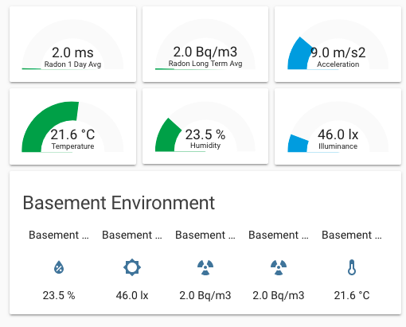

# sensor.airthings_wave
[![GitHub Release][releases-shield]][releases]
[![GitHub Activity][commits-shield]][commits]
[![custom_updater][customupdaterbadge]][customupdater]
[![License][license-shield]](LICENSE.md)

![Project Maintenance][maintenance-shield]
[![BuyMeCoffee][buymecoffeebadge]][buymecoffee]
[![BuyMeCoffee][buymebeerbadge]][buymebeer]

[![Discord][discord-shield]][discord]
[![Community Forum][forum-shield]][forum]

hassio support for Airthings Wave BLE environmental radon sensor.



Much of the code to build this component was inspired by these projects:
* http://airthings.com/raspberry-pi/
* https://github.com/marcelm/radonwave

The aforementioned `radonwave` project is especially useful as it describes
many of the BLE characteristics specific to this product and has good
trouble-shooting tips. The script provided is also very useful in determining
the MAC address of your AW device. See here:
https://github.com/marcelm/radonwave/issues/3

## Getting started

Download
```
/custom_components/airthings_wave/
```
into
```
<config directory>/custom_components/airthings_wave/
```
**Example configuration.yaml:**

```yaml
# Example configuration.yaml entry
sensor:
  - platform: airthings_wave
    mac: "98:07:2D:4A:97:5C"
    name: 'Basement Airthings Wave'
    scan_interval: 120
```
### Configuration Variables

**mac**

  (string)(Required) The airthings_wave mac address

**name**

  (string)(Optional) The name of the device. Defaults to 'Airthings Wave'

**scan_interval**

  (string)(Optional) The interval between polls. Defaults to 300 seconds (5 minutes)

## Limitations

It may be possible that the Wave must be connected to the official app at least
once before you can use this program, so you will probably not get around
registering an account with Airthings.

The radon level history stored on the Wave itself cannot be accessed
with this component. To get around this, it connects regularly to the radon
detector.

Make sure you install the latest firmware on the device using the official app
first.

## Known Issues

* Note yet compatible with Airthings Wave __Plus__

* Values only appear after first scan_interval (default 5 minutes) has passed
and will remain as `unknown` until then
https://github.com/custom-components/sensor.airthings_wave/issues/2

* Not yet compatible with
[custom_updater](https://github.com/custom-components/custom_updater) and
[tracker-card](https://github.com/custom-cards/tracker-card)

* Not yet able to specify the `monitored_conditions` configuration

* No translations available yet


## Hardware Requirements

* An Airthings Wave

* A Raspberry Pi 3 with built-in Bluetooth __OR__ a Bluetooth adapter that supports Bluetooth Low Energy (BLE). such as this
one: https://www.amazon.com/dp/B01N5MGEUS/ref=cm_sw_r_tw_dp_U_x_ObdNCb03P7QZJ

## Other Resources
* https://github.com/marcelm/radonwave/issues/1
* https://community.home-assistant.io/t/radoneye-ble-interface/94962
* https://support.airthings.com/hc/en-us/articles/115002910089-How-to-respond-to-your-radon-levels?mobile_site=true
* https://community.home-assistant.io/t/converting-sensor-measurement-units/98807
* http://certi.us/Downloads/Canada_Meas_BW.pdf

[airthings_wave]: https://github.com/custom-components/sensor.airthings_wave
[buymecoffee]: https://buymeacoff.ee/MartyTremblay
[buymecoffeebadge]: https://img.shields.io/badge/buy%20me%20a%20coffee-donate-yellow.svg?style=for-the-badge
[buymebeer]: https://paypal.me/MartyTremblay
[buymebeerbadge]: https://img.shields.io/badge/buy%20me%20a%20beer-donate-yellow.svg?style=for-the-badge
[commits-shield]: https://img.shields.io/github/commit-activity/y/custom-components/sensor.airthings_wave.svg?style=for-the-badge
[commits]: https://github.com/custom-components/sensor.airthings_wave/commits/master
[customupdater]: https://github.com/custom-components/custom_updater
[customupdaterbadge]: https://img.shields.io/badge/custom__updater-true-success.svg?style=for-the-badge
[discord]: https://discord.gg/Qa5fW2R
[discord-shield]: https://img.shields.io/discord/330944238910963714.svg?style=for-the-badge
[exampleimg]: example.png
[forum-shield]: https://img.shields.io/badge/community-forum-brightgreen.svg?style=for-the-badge
[forum]: https://community.home-assistant.io/
[license-shield]: https://img.shields.io/github/license/custom-components/sensor.airthings_wave.svg?style=for-the-badge
[maintenance-shield]: https://img.shields.io/badge/maintainer-MartyTremblay-blue.svg?style=for-the-badge
[releases-shield]: https://img.shields.io/github/release/custom-components/sensor.airthings_wave.svg?style=for-the-badge
[releases]: https://github.com/custom-components/sensor.airthings_wave/releases
